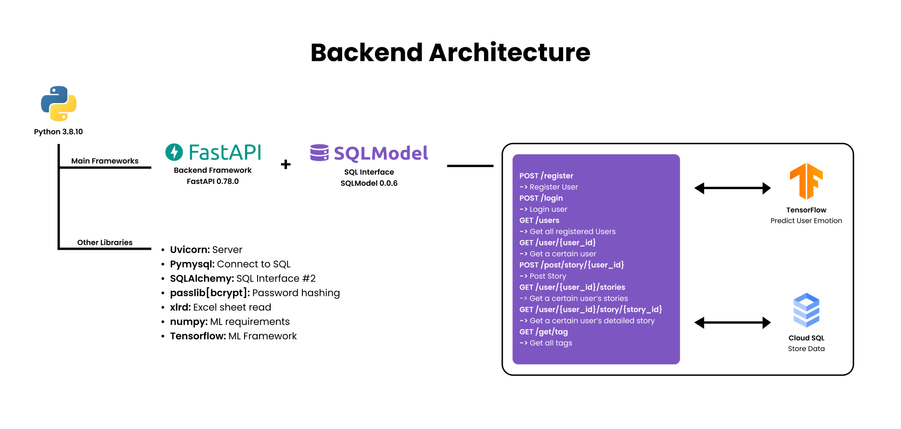

# Quotip
 BANGKIT Capstone Project
 
 A safe place to share your days both good and bad. Quotip is where you can be yourself. Make notes about how your day in detail and see what recommendations are given to you! Quotip will give you a gift in the form of useful quotes and activities adjusting to the story that you tell about your day.
			

## Collabolator
### Google Bangkit 2022 Capstone Project - Quotip (C22-PS016)
- Christopher Tri Anugrah (C7320F2798) - Cloud Computing -  Universitas Surabaya
- Nandaffa Rizky Putra (C2004F0360) - Cloud Computing - Institut Teknologi Sepuluh Nopember
- Billy Renatasiva (M2320F2806) - Machine Learning - Universitas Surabaya
- Venansius Mario Tando (M2320F2804) - Machine Learning -  Universitas Surabaya
- Mohammad Ilham (A2004F0380) - Mobile Development - Institut Teknologi Sepuluh Nopember
- Arshad Tareeq Buchori (A2004N0386) - Mobile Development - Institut Teknologi Sepuluh Nopember

# Cloud (Backend & Frontend) - Documentation
## The Websites

## Getting Started (API)
Here are a few steps to get our system up and running in your local computer :
1. **Prequerities** :
    - Python `3.8.10 or above`
    - FastAPI `0.78.0`
    - Uvicorn
    - SQLModel `0.0.6`
    - Pymysql
    - SQLAlchemy `1.4.35`
    - passlib[bcrypt] 
    - xlrd `1.2.0`
    - numpy
    - Tensorflow

2. **Initial Setup** :
    - Clone our project [Github Repo](https://github.com/tototheshadow/Quotip)
    - Navigate to CC/backend_fix
    - Modify `db.py` to meet your requirements (Change database link, etc.) **yes we know, we know, we know, it is a VERY bad practice. this will be fixed soon**
    - Create Python virtual environment on the folder by using `python3 -m venv env`, and activate the environment running `activate.bat` file on the env file (for Windows)
    - Install the requirements `pip install -r requirements.txt`
    - Run the server with uvicorn `python3 -m uvicorn main:app --reload` (This is enough if you’re just running the API on your local machine)
    - Navigate to `127.0.0.1/docs` or `127.0.0.1/redoc` to see the documentation and test the endpoints.

## API Architecture

We integrated the ML solution to our API for easy access. There are 8 Endpoints in our API which are:
1. Register User
2. Login User
3. Get all registered users
4. Get a user's details
5. Post story
6. Get a user's stories
7. Get a user's particular story's details
8. Get all tags

For interactive documentation, you can run the app by following the instructions on the first segment and opening the interactive documentation.

# Machine Learning Model - Documentation
Training Result:

Testing Trained Model:
model is tested using the statement "i never felt so good" and the model predict 1 to be the highest which is joy.

# Mobile App - Documentation

Firstly we plan our **design thinking** methodology by first emphetize what problems can our team tackle and we chose **mental health**, then we define the core problem and brainstorm some great Ideas which eventually got us to Quotip
One of the first things we do is making a rough **sketches** of the Quotip app in **figma** which is also used by us as a all in one designing tool
Then we put the designs to the test by making a **low and high fidelity prototypes**. By this point we has already decided that the basic app layout would be a **bottom menu** app with three pages done by using **three fragments**. Each are named **home, history, and settings**.
Once we are pleased with the designs we then apply them to the app using **kotlin** as what has been required by the **Bangkit Capstone program**.
In order to fulfill the functions of the app that we originally planned we needed an API and a backend algorithm to give us the responses for each story a user gives us.
**Quotip Description**
**Quotip** is the modern app for you who wants a place to share your day. In order to be this there are some key features of the app that are essential to what we planned the app to accomplish in the first place.
Features we intended the app to have are 5 which are : 
-Login and Registration
-Post Story
-History
-Settings
-History Detail with Recommendation Activity
All of which are using custom APIs.
The main feature of the app is it’s **Story feature**. The Story feature in Quotip is like most note apps but with it’s content stored and processed by the algorithm on the backend.
The backend then gives a response to the story that has been given in the form of **quotes and activities**.
After doing it for a while, you can see your **old stories** with the **History feature**.
